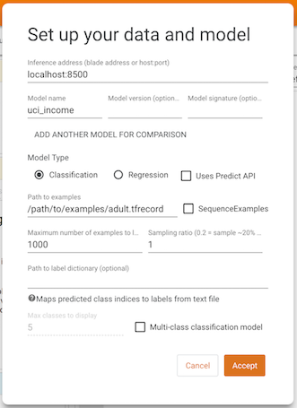

# 使用 What-If Tool 仪表板理解模型

What-If Tool (WIT) 提供了易于使用的界面，可以帮助您加深对黑盒分类和回归机器学习模型的理解。使用该插件，您可以基于大量样本执行推断，并立即以多种方式可视化结果。此外，还可以手动或以编程方式编辑样本，然后在模型中重新运行样本以查看变更的结果。WIT 包含的工具可用于分析模型在数据集子集上的性能和公平性。

该工具旨在提供一种简单、直观且功能强大的方式，使用户无需任何代码即可通过可视界面浏览和分析训练的机器学习模型。

该工具可通过 TensorBoard 或直接在 Jupyter 或 Colab 笔记本中访问。有关更多深入详细信息、演示、演练以及在笔记本模式下使用 WIT 的特定信息，请参见 [What-If Tool 网站](https://pair-code.github.io/what-if-tool)。

## 要求

要在 TensorBoard 中使用 WIT，需要满足以下两项要求：

- 您要浏览的模型必须使用 [TensorFlow Serving](https://github.com/tensorflow/serving) 通过分类 、回归或预测 API 提供。
- 由模型推断的数据集必须位于 TensorBoard 网络服务器可访问的 TFRecord 文件中。

## 使用方法

在 TensorBoard 中打开 What-If Tool 仪表板时，您将看到一个设置屏幕，您需要在此提供模型服务器的主机与端口、要提供的模型的名称、模型的类型以及 TFRecords 文件的加载路径。填写完这些信息并点击 Accept 后，WIT 将加载数据集并使用模型运行推断，同时显示结果。

有关 WIT 的不同功能以如何借助这些功能理解模型和执行公平性分析的详细信息，请参见 [What-If Tool 网站](https://pair-code.github.io/what-if-tool)上的演练。

## 演示模型和数据集

如果想要在 TensorBoard 中使用预训练的模型测试 WIT，您可以从 https://storage.googleapis.com/what-if-tool-resources/uci-census-demo/uci-census-demo.zip 下载并解压预训练模型和数据集。该模型为使用 [UCI 美国人口普查](https://archive.ics.uci.edu/ml/datasets/census+income)数据集的二元分类模型，用于预测个人年收入是否超过 5 万美元。机器学习建模和公平性研究中经常使用此数据集和预测任务。

将环境变量 MODEL_PATH 设置为计算机上生成的模型的目录位置。

按照[官方文档](https://www.tensorflow.org/serving/docker)安装 Docker 和 TensorFlow Serving。

通过 `docker run -p 8500:8500 --mount type=bind,source=${MODEL_PATH},target=/models/uci_income -e MODEL_NAME=uci_income -t tensorflow/serving` 使用 Docker 提供模型。请注意，您可能需要使用 `sudo` 运行命令，具体取决于您的 Docker 设置。

现在，启动 TensorBoard 并使用信息中心下拉菜单导航至 What-If Tool。

在设置屏幕中，将推断地址设置为“localhost:8500”，模型名称设置为“uci_income”，样本路径设置为下载的 `adult.tfrecord` 文件的完整路径，然后按 Accept。

基于演示，可以使用 What-If Tool 尝试以下操作：

- 编辑单个数据点并查看由此造成的推断变化。
- 通过部分依赖图分析数据集中各个特征与模型推断结果之间的关系。
- 将数据集切片为子集，然后对比切片之间的性能。

要深入了解该工具的功能，请参阅 [What-If Tool 演练](https://pair-code.github.io/what-if-tool/walkthrough.html)。

请注意，此模型试图预测的数据集内的真实特征名为“Target”，因此，使用“Performance & Fairness”标签页时，应在真实特征下拉列表中指定“Target”。
